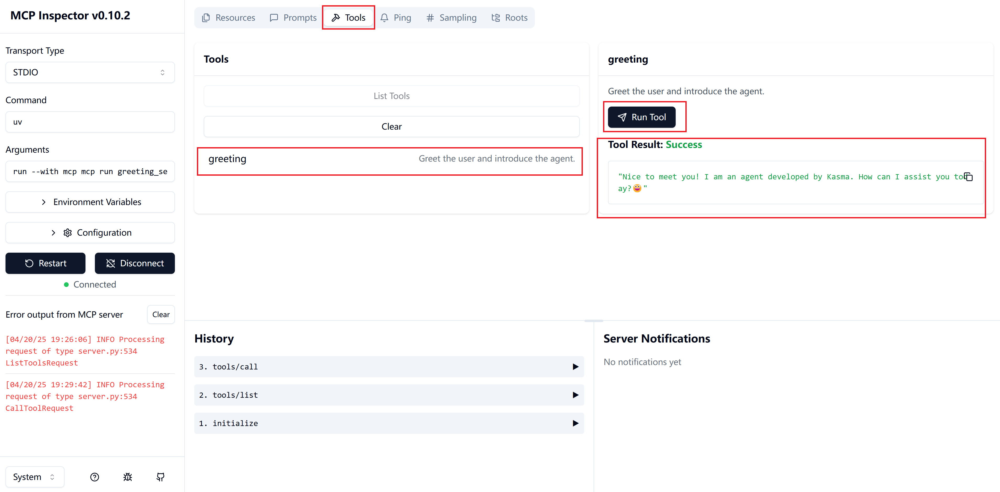

# MCP Server Development: From Beginner to Expert
There are already many excellent resources available, so this guide won't dwell on excessive details. Instead, it will outline the regular process of MCP Server Development, with appropriate reference links provided for each step.

## What is Model Context Protocol(MCP)?
MCP originated from the article [Introducing the Model Context Protocol](https://www.anthropic.com/news/model-context-protocol) released by Anthropic on November 25, 2024. Simply put, MCP is a standardized protocol akin to a USB-C port, simplifying how AI models interact with data, tools, and services.

### References
- [Introducing the Model Context Protocol](https://www.anthropic.com/news/model-context-protocol)
- [What is Model Context Protocol (MCP)? How it simplifies AI integrations compared to APIs](https://norahsakal.com/blog/mcp-vs-api-model-context-protocol-explained/)
- [MCP (Model Context Protocol)，一篇就够了。](https://zhuanlan.zhihu.com/p/29001189476)

## MCP Servers Community
Before developing an MCP Server, it's essential to explore established MCP communities to check if there are already servers that implement the functionality we need. Alternatively, we can learn from similar MCP Servers to avoid reinventing the wheel. This research phase helps us build upon existing solutions rather than starting from scratch.

### References
- [Official MCP Servers](https://github.com/modelcontextprotocol/servers)
- [Awsesome MCP Servers](https://github.com/punkpeye/awesome-mcp-servers)
- [MCP Servers Website](https://mcpservers.org/)
- [MCP.so: The largest collection of MCP servers](https://mcp.so/)
- [魔搭 MCP 广场](https://modelscope.cn/mcp)
- [阿里云百炼 MCP 广场](https://bailian.console.aliyun.com/?spm=a2c4g.11186623.0.0.48571e19QfWzsg&tab=mcp#/mcp-market)

## MCP Server Implementation
The MCP protocol defines three core primitives that servers can implement: tools, prompts and resources. Here we will focus on `tools` (as the other two features haven't yet received widespread support).

1. Environment Setup ([uv](https://docs.astral.sh/uv/) recommended)
2. Clarify which tools the MCP server needs to provide, along with their specific descriptions and required parameters
3. Implement the MCP Server ([FastMCP](https://gofastmcp.com/getting-started/welcome) recommended)
4. Test Functionality ([MCP Inspector](https://github.com/modelcontextprotocol/inspector) recommended)
5. Write README.md - Create a comprehensive README that helps users understand and use your MCP server. You can reference the structure of other MCP server READMEs for guidance on what to include.

Now let's implement a simple MCP Server:
For example, let's say we've developed our own agent system and we want the system to respond with: "We are an AI agent developed by xxx" when users greet simply. We can implement a `greeting_server.py` that includes a greeting tool called `greeting`:
```python
from mcp.server.fastmcp import FastMCP


mcp = FastMCP("greeting_server")


@mcp.tool()
async def greeting() -> str:
    """
    Greet the user and introduce the agent.
    """
    return "Nice to meet you! I am an agent developed by Kasma. How can I assist you today?😃"


def main() -> None:
    """Run the greeting MCP server."""
    try:
        mcp.run()
    except Exception as e:
        print(f"Error starting server: {str(e)}")
        raise


if __name__ == "__main__":
    main()
```
Then we can use the official MCP Inspector to test our implementation by running the following command in the same directory as the server:
```bash
mcp dev greeting_server.py
```
We will see output similar to the following in the terminal:
```bash
Starting MCP inspector...
⚙️ Proxy server listening on port 6277
🔍 MCP Inspector is up and running at http://127.0.0.1:6274 🚀
```
In the opened browser, click on: Connect &rarr; Tools &rarr; List tools &rarr; Run Tool

If successfully implemented, you'll be able to see the results of the tool execution as shown below.


### References
- [Quickstart For Server Developers](https://modelcontextprotocol.io/quickstart/server)
- [Python SDK](https://github.com/modelcontextprotocol/python-sdk)
- [Official MCP Documents](https://modelcontextprotocol.io/introduction)
